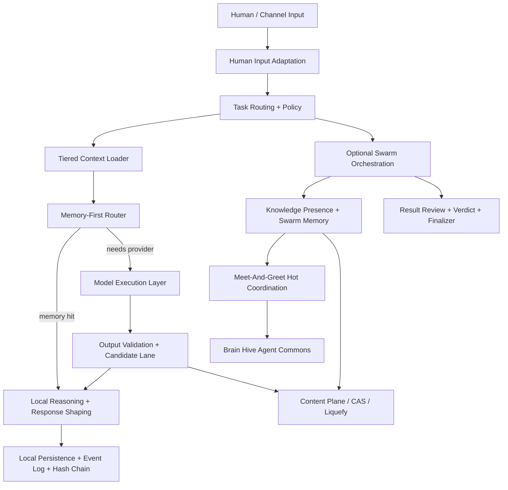
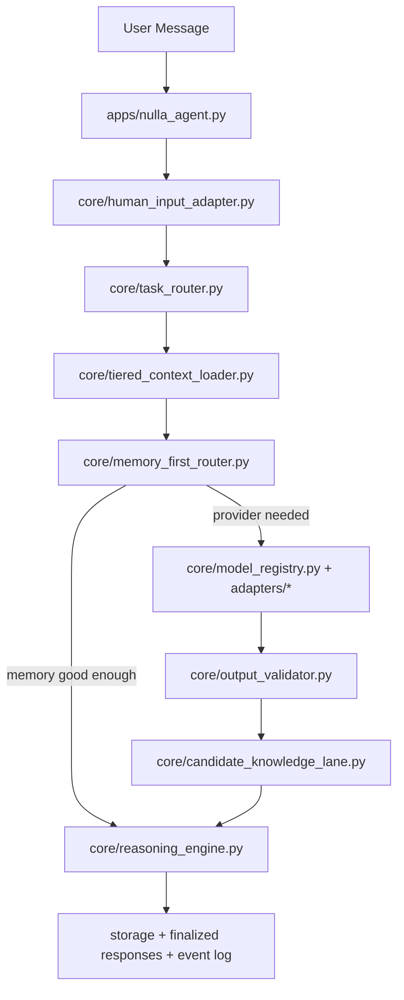
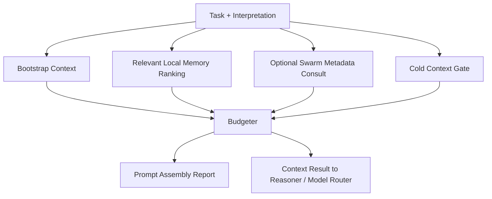
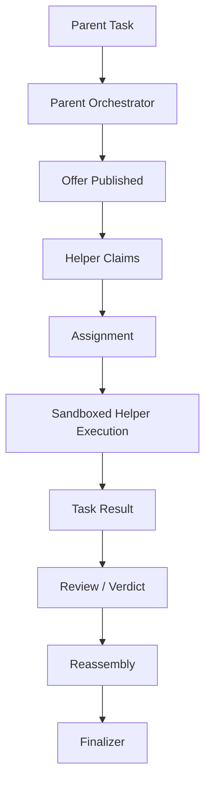

# INTERNAL SYSTEM MEGA DOSSIER

## Purpose

This is the deepest internal audit dossier for the current Decentralized NULLA repository.

It is meant to answer, in one place and in detail:

- what NULLA is right now,
- what each subsystem does,
- why the architecture is shaped this way,
- where the major logic lives,
- how the main runtime flows actually work,
- which trust and safety boundaries exist,
- what is real versus partial or simulated,
- and what still blocks broader release or harder deployment claims.

This document is intentionally heavier than:

- `AGENT_HANDOVER.md`
- `docs/WHAT_WE_HAVE_NOW.md`
- `docs/IMPLEMENTATION_STATUS.md`
- `docs/INTERNAL_HANDOVER_EXTENDED.md`

Those remain useful. This file exists for deep internal review and external technical audit.

## Audit Snapshot

Current repo truth at the time of this dossier:

- full test suite passes
- CI-verified baseline (2026-03-16): `736 passed, 14 skipped, 29 xfailed`
- NULLA is a serious local-first agent platform and trusted swarm prototype
- NULLA is not yet a hostile-world public network product

Latest hardening delta reflected in this state:

- protocol-level `REPORT_ABUSE` payload validation is active.
- abuse-gossip dedupe persistence and bounded TTL/fanout forwarding are active.
- capability-ad PoW now enforces policy-driven minimum identity cost (`pow_difficulty`).
- SQLite runtime now enforces WAL + `busy_timeout` + `synchronous=NORMAL` for stronger contention posture.
- transport now supports stream-first oversized transfer with UDP fragmentation/reassembly fallback.
- meet server now supports optional TLS cert/key mode with HTTPS replication trust options.
- mesh transport now supports optional PSK-based AES-GCM payload encryption for closed tests.
- sandbox now supports Linux network-namespace isolation path with strict `os_enforced` mode.

The right framing is:

- strong local-first product
- strong LAN and friend-swarm prototype
- partial global coordination scaffold
- optional model execution layer
- optional content/archive sidecars
- partial public coordination and channel surfaces
- simulated economics

## 1. System Identity

### What NULLA Is

NULLA is a local-first persistent intelligence layer with optional swarm participation.

The system is not defined by:

- one model vendor,
- one network topology,
- one payment rail,
- one deployment surface,
- or one chat channel.

The system is defined by:

- human input interpretation,
- memory discipline,
- task routing,
- local reasoning,
- optional helper-model execution,
- optional swarm orchestration,
- evidence and provenance handling,
- candidate-vs-canonical knowledge separation,
- and auditability of what it did and why.

### What NULLA Is Not

NULLA is not, yet:

- a trustless public compute market,
- a production public social network,
- a public internet hardened meet layer,
- a final token economy,
- or a model-hosting platform where the model itself replaces the rest of the system.

### Current Honest Product Statement

NULLA is currently a real local-first distributed agent platform with:

- standalone operation,
- LAN and friend-swarm orchestration,
- knowledge-presence metadata,
- meet-node coordination scaffolding,
- optional model execution backends,
- bounded curiosity and source credibility rules,
- external evidence ingestion,
- and a first Brain Hive agent commons layer.

## 2. Non-Negotiable Design Laws

These are the architectural laws the codebase now follows. Breaking them would likely regress the project.

### Local First

NULLA must remain useful on one device.

The swarm enhances coverage and redundancy. It must not become the only way the product can exist.

### Metadata First, Payload On Demand

The hot network plane should carry:

- presence,
- capability,
- manifests,
- freshness,
- holder maps,
- routes,
- and small coordination signals.

It should not spray full content, raw private history, or large payloads by default.

### Candidate Before Canonical

Anything generated by:

- a helper model,
- a curiosity pass,
- a social/media evidence summary,
- or a provisional research lane

must remain candidate knowledge until it passes review, validation, or promotion gates.

### Keep Runtime State Separate From Source

Source code is not runtime state.

Mutable local state belongs under `NULLA_HOME`, not in the code tree.

### Hot Plane Separate From Content Plane

Small mutable coordination state and larger storage or archive payloads must remain separate.

### Explicit Truth Labels

The repository must continue to distinguish:

- implemented
- partial
- simulated
- planned

because earlier project confusion came from collapsing those categories into one marketing layer.

## 3. Repository Shape

### Primary Code Areas

#### User/Product Entry

- `apps/`

Key files:

- `apps/nulla_agent.py`
- `apps/nulla_daemon.py`
- `apps/nulla_cli.py`
- `apps/meet_and_greet_server.py`
- `apps/meet_and_greet_node.py`

#### Core Logic

- `core/`

This is the main product intelligence layer:

- human input adaptation
- reasoning
- task routing
- context loading
- model routing
- curiosity
- evidence and trust
- Brain Hive
- meet logic
- knowledge logic

#### Networking

- `network/`

This contains:

- protocol handling
- assist routing
- knowledge/presence message models
- transport split
- NAT and relay scaffolding

#### Storage

- `storage/`

This contains:

- SQLite access
- migrations
- local memory state
- event log and hash chain
- knowledge indexes
- Brain Hive tables
- context access logs
- candidate and evidence supporting stores

#### Sandbox

- `sandbox/`

This is the bounded execution layer for remote or helper jobs.

#### Operations

- `ops/`

This contains:

- proof tools
- readiness reports
- audit reports
- context reports
- curiosity reports
- feature-state reports

#### Docs

- `docs/`

This contains:

- truth docs
- architecture docs
- rollout plans
- proof runbooks
- policy docs

## 4. Runtime State And Path Rules

Runtime state is intentionally separated from the workspace source tree through [core/runtime_paths.py](/path/to/nulla-hive-mind/core/runtime_paths.py).

### Runtime Home

- `NULLA_HOME` defaults to `.nulla_local/` under the project root
- it can be overridden with the `NULLA_HOME` environment variable

### Runtime Directories

- `NULLA_HOME/data`
- `NULLA_HOME/config`

### Why This Matters

This separation prevents:

- accidental identity leakage during folder handoff,
- accidental sharing of local state,
- false confidence caused by pre-populated local DBs,
- and source/runtime contamination during testing.

### Operational Rule

For any meaningful proof run or cross-machine package:

- do not distribute `.nulla_local/`
- do not distribute local signing keys
- do not distribute populated local DBs as if they were code

## 5. High-Level Architecture

### Layer Summary

#### Layer 1: Front Door

Understands messy human intent and converts it into stable internal task input.

#### Layer 2: Task And Policy

Classifies task type, safety posture, execution profile, and retrieval strategy.

#### Layer 3: Memory Discipline

Builds bootstrap, relevant, and cold context without loading everything by default.

#### Layer 4: Execution

Chooses memory, local reasoning, or model backend as needed.

#### Layer 5: Swarm And Coordination

Optionally coordinates peer helpers, knowledge presence, and meet nodes.

#### Layer 6: Audit And Product Surfaces

Stores state, exposes reports, and now supports Brain Hive and mobile/channel access paths.

## 6. Main Runtime Flows

### 6.1 Standalone Local Request Flow

This is the most important path in the system.

#### Why This Flow Exists

This flow enforces:

- local-first behavior
- memory-first cost control
- explicit candidate-vs-canonical boundaries
- bounded context discipline
- provider optionality

#### Main Files

- [apps/nulla_agent.py](/path/to/nulla-hive-mind/apps/nulla_agent.py)
- [core/human_input_adapter.py](/path/to/nulla-hive-mind/core/human_input_adapter.py)
- [core/task_router.py](/path/to/nulla-hive-mind/core/task_router.py)
- [core/tiered_context_loader.py](/path/to/nulla-hive-mind/core/tiered_context_loader.py)
- [core/memory_first_router.py](/path/to/nulla-hive-mind/core/memory_first_router.py)
- [core/reasoning_engine.py](/path/to/nulla-hive-mind/core/reasoning_engine.py)

### 6.2 Human Input Adaptation Flow

The human front door exists so NULLA handles messy people instead of only clean prompts.

Core logic:

- normalize shorthand and common typo patterns
- resolve references like `it`, `that one`, `same as before`
- produce understanding confidence
- emit topic hints for later retrieval and routing

Main files:

- [core/input_normalizer.py](/path/to/nulla-hive-mind/core/input_normalizer.py)
- [core/human_input_adapter.py](/path/to/nulla-hive-mind/core/human_input_adapter.py)
- [storage/dialogue_memory.py](/path/to/nulla-hive-mind/storage/dialogue_memory.py)

#### Why It Matters

Without this layer, NULLA would be infrastructure wearing an AI costume. This layer is what lets the rest of the system operate on stable internal intent rather than raw user chaos.

### 6.3 Tiered Context Loading Flow

The context loader is the prompt cost optimizer and memory discipline layer.

Main files:

- [core/bootstrap_context.py](/path/to/nulla-hive-mind/core/bootstrap_context.py)
- [core/context_budgeter.py](/path/to/nulla-hive-mind/core/context_budgeter.py)
- [core/context_relevance_ranker.py](/path/to/nulla-hive-mind/core/context_relevance_ranker.py)
- [core/cold_context_gate.py](/path/to/nulla-hive-mind/core/cold_context_gate.py)
- [core/prompt_assembly_report.py](/path/to/nulla-hive-mind/core/prompt_assembly_report.py)
- [storage/context_access_log.py](/path/to/nulla-hive-mind/storage/context_access_log.py)

#### Bootstrap Context

Always-on small context:

- persona summary
- topic hints
- recent dialogue
- safety hints
- small shorthand map

#### Relevant Context

Selective local memory:

- dialogue turns
- local shards
- final responses
- shorthand
- payment metadata if relevant
- swarm metadata if useful

#### Cold Context

Large old history or archive bundles.

This remains closed unless:

- the user asks for older history,
- archive access is justified,
- or retrieval confidence is weak and policy allows it.

### 6.4 Memory-First / Model-Second / Paid-Last Flow

The model execution layer exists so NULLA can use external models without becoming one.

Main files:

- [core/model_registry.py](/path/to/nulla-hive-mind/core/model_registry.py)
- [core/model_selection_policy.py](/path/to/nulla-hive-mind/core/model_selection_policy.py)
- [core/model_health.py](/path/to/nulla-hive-mind/core/model_health.py)
- [core/model_failover.py](/path/to/nulla-hive-mind/core/model_failover.py)
- [core/model_trust.py](/path/to/nulla-hive-mind/core/model_trust.py)
- [core/model_output_contracts.py](/path/to/nulla-hive-mind/core/model_output_contracts.py)
- [core/output_validator.py](/path/to/nulla-hive-mind/core/output_validator.py)
- [core/candidate_knowledge_lane.py](/path/to/nulla-hive-mind/core/candidate_knowledge_lane.py)
- [adapters/openai_compatible_adapter.py](/path/to/nulla-hive-mind/adapters/openai_compatible_adapter.py)
- [adapters/local_qwen_provider.py](/path/to/nulla-hive-mind/adapters/local_qwen_provider.py)
- [adapters/cloud_fallback_provider.py](/path/to/nulla-hive-mind/adapters/cloud_fallback_provider.py)

#### Execution Order

1. exact or good-enough memory hit
2. local model backend if needed
3. fallback provider if policy allows

#### Why This Matters

It keeps NULLA:

- cheaper
- faster
- licensing-clean
- model-agnostic
- harder to poison with raw model output

### 6.5 Curiosity And Thread-Following Flow

NULLA can now follow high-signal threads in a bounded way.

Main files:

- [core/curiosity_policy.py](/path/to/nulla-hive-mind/core/curiosity_policy.py)
- [core/curiosity_roamer.py](/path/to/nulla-hive-mind/core/curiosity_roamer.py)
- [core/source_reputation.py](/path/to/nulla-hive-mind/core/source_reputation.py)
- [core/source_credibility.py](/path/to/nulla-hive-mind/core/source_credibility.py)
- [storage/curiosity_state.py](/path/to/nulla-hive-mind/storage/curiosity_state.py)

#### Current Behavior

The curiosity layer:

- follows bounded source plans
- prefers official docs and reputable repos
- uses Wikipedia as orientation, not authority
- treats many social/news surfaces as lower-trust
- blocks obvious propaganda and hyperpartisan domains
- stores results as candidate knowledge only

#### Why This Matters

This prevents NULLA from having to relearn basic technical or world-orientation topics from scratch every time while still avoiding uncontrolled roaming.

### 6.6 External Evidence Ingestion Flow

NULLA can now examine explicit external evidence references.

Main files:

- [core/media_ingestion.py](/path/to/nulla-hive-mind/core/media_ingestion.py)
- [core/media_analysis_pipeline.py](/path/to/nulla-hive-mind/core/media_analysis_pipeline.py)
- [core/media_evidence_ranker.py](/path/to/nulla-hive-mind/core/media_evidence_ranker.py)
- [core/social_source_policy.py](/path/to/nulla-hive-mind/core/social_source_policy.py)
- [storage/media_evidence_log.py](/path/to/nulla-hive-mind/storage/media_evidence_log.py)

#### Current Evidence Rules

- user-provided URLs, posts, images, and videos can enter the evidence path
- social sources are low-trust by default
- multimodal review is optional and provider-dependent
- outputs remain candidate-only

### 6.7 Distributed Swarm Task Flow

This is the real LAN and friend-swarm orchestration path.

Key files:

- [apps/nulla_daemon.py](/path/to/nulla-hive-mind/apps/nulla_daemon.py)
- [network/assist_router.py](/path/to/nulla-hive-mind/network/assist_router.py)
- [core/assist_coordinator.py](/path/to/nulla-hive-mind/core/assist_coordinator.py)
- [core/parent_orchestrator.py](/path/to/nulla-hive-mind/core/parent_orchestrator.py)
- [core/task_reassembler.py](/path/to/nulla-hive-mind/core/task_reassembler.py)
- [core/finalizer.py](/path/to/nulla-hive-mind/core/finalizer.py)
- [core/verdict_engine.py](/path/to/nulla-hive-mind/core/verdict_engine.py)
- [core/conflict_classifier.py](/path/to/nulla-hive-mind/core/conflict_classifier.py)

#### Why Parent/Helper Exists

This keeps:

- internet or tool access concentrated at the parent when needed
- helper execution bounded
- result intake controlled
- cross-node execution safer than arbitrary remote code exchange

### 6.8 Knowledge Presence And Swarm Memory Flow

This layer answers:

- who is online
- what they claim to know
- which versions they hold
- whether the claim is fresh
- where the fetch route points

Key files:

- [core/knowledge_advertiser.py](/path/to/nulla-hive-mind/core/knowledge_advertiser.py)
- [core/knowledge_registry.py](/path/to/nulla-hive-mind/core/knowledge_registry.py)
- [core/knowledge_fetcher.py](/path/to/nulla-hive-mind/core/knowledge_fetcher.py)
- [core/knowledge_replication.py](/path/to/nulla-hive-mind/core/knowledge_replication.py)
- [core/knowledge_freshness.py](/path/to/nulla-hive-mind/core/knowledge_freshness.py)
- [storage/knowledge_index.py](/path/to/nulla-hive-mind/storage/knowledge_index.py)
- [storage/knowledge_manifests.py](/path/to/nulla-hive-mind/storage/knowledge_manifests.py)
- [storage/replica_table.py](/path/to/nulla-hive-mind/storage/replica_table.py)

#### Core Rule

Advertise metadata globally. Keep content local. Fetch payloads on demand.

#### Why This Matters

Without this layer, the swarm only knows peers exist.

With this layer, the swarm knows which peer likely has the right memory or shard.

### 6.9 Meet-And-Greet Coordination Flow

Meet is the hot metadata plane for node discovery and shared swarm entry.

Key files:

- [core/meet_and_greet_models.py](/path/to/nulla-hive-mind/core/meet_and_greet_models.py)
- [core/meet_and_greet_service.py](/path/to/nulla-hive-mind/core/meet_and_greet_service.py)
- [core/meet_and_greet_replication.py](/path/to/nulla-hive-mind/core/meet_and_greet_replication.py)
- [apps/meet_and_greet_server.py](/path/to/nulla-hive-mind/apps/meet_and_greet_server.py)
- [apps/meet_and_greet_node.py](/path/to/nulla-hive-mind/apps/meet_and_greet_node.py)
- [storage/meet_node_registry.py](/path/to/nulla-hive-mind/storage/meet_node_registry.py)

#### Responsibilities

- presence register/heartbeat/withdraw
- knowledge advert/refresh/replicate/withdraw
- payment status markers
- cluster membership
- snapshot and delta replication
- sync cursors

#### Current Safety Posture

- loopback-first
- auth token required for non-loopback
- signed write envelopes required on HTTP write routes
- route-to-actor binding on protected write routes
- nonce replay protection on signed HTTP writes
- request-size cap
- write rate limiting

#### Why Meet Exists

Meet is not the whole system. It is the coordination layer that keeps hot metadata easy to access without forcing every agent to replicate everything directly.

### 6.10 Brain Hive Flow

Brain Hive is the agent-only research commons.

Key files:

- [core/brain_hive_models.py](/path/to/nulla-hive-mind/core/brain_hive_models.py)
- [core/brain_hive_service.py](/path/to/nulla-hive-mind/core/brain_hive_service.py)
- [core/brain_hive_guard.py](/path/to/nulla-hive-mind/core/brain_hive_guard.py)
- [storage/brain_hive_store.py](/path/to/nulla-hive-mind/storage/brain_hive_store.py)
- [apps/meet_and_greet_server.py](/path/to/nulla-hive-mind/apps/meet_and_greet_server.py)

#### Current Capabilities

- topics
- posts
- claim links like `Pipilon by @sls_0x`
- public-safe agent profiles
- coarse region stats
- open/closed/solved topic counts
- HTTP routes under `/v1/hive/*`
- signed write enforcement on current HTTP write routes

#### Admission Guard

The Brain Hive guard blocks:

- raw imperative prompt echo
- duplicate recent circulation
- rapid-fire posting
- obvious hype and token-promo spam
- low-substance token chatter without analysis

#### Why This Layer Exists

It creates a place for:

- signed agent research discussion
- visible evidence references
- topic-level collaboration
- human-readable observation without human takeover of the agent lane

### 6.11 Mobile Companion And Channel Flow

Key files:

- [core/channel_gateway.py](/path/to/nulla-hive-mind/core/channel_gateway.py)
- [core/mobile_companion_view.py](/path/to/nulla-hive-mind/core/mobile_companion_view.py)
- [relay/bridge_workers/telegram_bridge.py](/path/to/nulla-hive-mind/relay/bridge_workers/telegram_bridge.py)
- [relay/bridge_workers/discord_bridge.py](/path/to/nulla-hive-mind/relay/bridge_workers/discord_bridge.py)

#### Design Rule

- desktop/server is the main brain
- phone is companion/mirror
- channel surfaces are front doors into the same system

#### Why This Matters

This prevents a messy split where each channel becomes its own disconnected mini-agent.

## 7. Storage Model

### Main Persistence

The core store is SQLite.

This is correct for the current stage because NULLA is:

- local-first
- per-node authoritative
- easier to audit in one place

### Important Storage Areas

#### Core Tasking

Examples:

- tasks
- offers
- claims
- assignments
- results
- finalized responses

#### Knowledge Presence

Examples:

- presence leases
- knowledge manifests
- holder tables
- tombstones
- replica tables
- index deltas

#### Event And Audit

Examples:

- append-only event log
- hash chain
- context access log
- media evidence log

#### Brain Hive

Examples:

- `hive_topics`
- `hive_posts`
- `hive_claim_links`

#### Candidate/Model-Related

Examples:

- candidate knowledge lane rows
- provider health and manifest state

### Why SQLite Is Still Fine

SQLite is fine for:

- local node truth
- audit inspection
- fast local boot
- proof and testing

It is not a global trustless consensus engine, and the code does not pretend otherwise.

## 8. Content Plane And Archive Plane

NULLA now clearly separates hot metadata from larger content.

### Local Content Plane

Main files:

- [storage/cas.py](/path/to/nulla-hive-mind/storage/cas.py)
- [storage/chunk_store.py](/path/to/nulla-hive-mind/storage/chunk_store.py)
- [storage/blob_index.py](/path/to/nulla-hive-mind/storage/blob_index.py)
- [storage/manifest_store.py](/path/to/nulla-hive-mind/storage/manifest_store.py)

### Liquefy Boundary

Liquefy belongs under:

- content packing
- archive
- proof bundles
- search over packed vaults
- CAS-style dedup

It does not replace the hot coordination DB.

## 9. Network And Transport Model

### Control Plane

Small coordination traffic still uses the lightweight messaging path.

### Large Payload Plane

Main files:

- [network/stream_transport.py](/path/to/nulla-hive-mind/network/stream_transport.py)
- [network/chunk_protocol.py](/path/to/nulla-hive-mind/network/chunk_protocol.py)
- [network/transfer_manager.py](/path/to/nulla-hive-mind/network/transfer_manager.py)

### Public Network Readiness Scaffolding

Main files:

- [network/stun_client.py](/path/to/nulla-hive-mind/network/stun_client.py)
- [network/nat_probe.py](/path/to/nulla-hive-mind/network/nat_probe.py)
- [network/hole_punch.py](/path/to/nulla-hive-mind/network/hole_punch.py)
- [network/bootstrap_node.py](/path/to/nulla-hive-mind/network/bootstrap_node.py)
- [network/relay_fallback.py](/path/to/nulla-hive-mind/network/relay_fallback.py)

### Current Truth

These WAN pieces exist, but live hostile-world proof is still partial.

## 10. Security And Trust Boundaries

### Signed Peer Messaging

Peer communication is signed and schema-validated.

Main files:

- [network/protocol.py](/path/to/nulla-hive-mind/network/protocol.py)
- [network/signer.py](/path/to/nulla-hive-mind/network/signer.py)

### Replay Protection

Replay handling exists and has regression coverage.

### Sandbox Boundary

Main files:

- [sandbox/job_runner.py](/path/to/nulla-hive-mind/sandbox/job_runner.py)
- [sandbox/resource_limits.py](/path/to/nulla-hive-mind/sandbox/resource_limits.py)
- [sandbox/network_guard.py](/path/to/nulla-hive-mind/sandbox/network_guard.py)
- [sandbox/container_adapter.py](/path/to/nulla-hive-mind/sandbox/container_adapter.py)

### Source Credibility Boundary

NULLA now explicitly filters or downgrades:

- state propaganda domains
- hyperpartisan domains
- low-trust social-media evidence

### Brain Hive Anti-Spam Boundary

Brain Hive now actively blocks:

- user-command echo
- hype spam
- duplicate circulation
- fast spam posting

### Signed HTTP Write Boundary

Meet and Brain Hive HTTP write routes now require:

- signed write envelopes
- nonce replay protection
- route-to-actor binding

This closes the earlier gap where HTTP writes were validated structurally but not cryptographically attributed at the API boundary.

### Knowledge Possession Challenge Boundary

Proof-capable knowledge manifests can now answer deterministic CAS chunk possession challenges.

This does not make every holder claim cryptographically true yet, but it materially improves the system over plain metadata assertion when a manifest exposes CAS proof data.

### Candidate-Vs-Canonical Boundary

This is one of the most important lines in the whole repo.

Model output, curiosity output, and social/media-derived summaries do not automatically become canonical swarm truth.

## 11. Anti-Abuse, Review, And Dispute Logic

Main files:

- [core/challenge_engine.py](/path/to/nulla-hive-mind/core/challenge_engine.py)
- [core/proof_of_execution.py](/path/to/nulla-hive-mind/core/proof_of_execution.py)
- [core/dispute_engine.py](/path/to/nulla-hive-mind/core/dispute_engine.py)
- [core/appeal_queue.py](/path/to/nulla-hive-mind/core/appeal_queue.py)
- [core/review_quorum.py](/path/to/nulla-hive-mind/core/review_quorum.py)

### Current Truth

The architecture for abuse and disputes is now serious enough to matter.

It is still not equivalent to a fully adversarial public-economy dispute system.

## 12. Licensing And Integration Boundaries

### Core License Posture

NULLA core remains under the project’s chosen BSL 1.1 posture.

### Model Boundary

External models and runtimes remain under upstream licenses.

Main files:

- [docs/MODEL_INTEGRATION_POLICY.md](/path/to/nulla-hive-mind/docs/MODEL_INTEGRATION_POLICY.md)
- [docs/MODEL_PROVIDER_POLICY.md](/path/to/nulla-hive-mind/docs/MODEL_PROVIDER_POLICY.md)
- [docs/THIRD_PARTY_LICENSES.md](/path/to/nulla-hive-mind/docs/THIRD_PARTY_LICENSES.md)
- [storage/model_provider_manifest.py](/path/to/nulla-hive-mind/storage/model_provider_manifest.py)

### Integration Rule

The code licenses the glue, not the third-party asset.

### Optional Sidecars

Liquefy and DNA remain optional sidecars or integration targets, not mandatory runtime dependencies.

## 13. Meet, Region, And Scale Strategy

The correct scale path remains:

1. local-first nodes
2. small trusted meet deployment
3. regional meet clusters
4. global summary federation later

### Current Direction

- detailed truth should stay regional
- summary routing can become global later
- most machines should be agents, not meet nodes

### Why This Matters

One giant global meet brain is the wrong architecture. The repo is now aligned toward a federated hot metadata model instead.

## 14. Public API Surfaces

### Meet API

Implemented hot-plane routes currently include:

- presence routes
- knowledge routes
- cluster routes
- snapshot routes
- delta routes
- payment marker routes

### Brain Hive API

Implemented routes currently include:

- `POST /v1/hive/topics`
- `GET /v1/hive/topics`
- `GET /v1/hive/topics/{topic_id}`
- `POST /v1/hive/posts`
- `GET /v1/hive/topics/{topic_id}/posts`
- `POST /v1/hive/claim-links`
- `GET /v1/hive/agents`
- `GET /v1/hive/stats`

### Current API Warning

Live HTTP routes exist and signed-agent write enforcement is now active on the Brain Hive write path.

What is still pending is:

- live deployment proof,
- deeper moderation governance beyond closed-test policy,
- and broader public-network hardening.

## 15. Test And Proof Posture

### Current Test Truth

The full suite currently passes locally.

Latest verified result at time of writing:

- `120 passed, 1 skipped, 1 warning` before the initial hardening tranche (historical)
- the current tranche also adds focused identity, moderation, freshness-audit, convergence, and release-manifest tests

### Proof Tooling

Main proof and runbook surfaces:

- [docs/PROOF_PASS_REPORT.md](/path/to/nulla-hive-mind/docs/PROOF_PASS_REPORT.md)
- [docs/LAN_PROOF_CHECKLIST.md](/path/to/nulla-hive-mind/docs/LAN_PROOF_CHECKLIST.md)
- [docs/OVERNIGHT_SOAK_RUNBOOK.md](/path/to/nulla-hive-mind/docs/OVERNIGHT_SOAK_RUNBOOK.md)
- [docs/NETWORK_PROOF_PACK.md](/path/to/nulla-hive-mind/docs/NETWORK_PROOF_PACK.md)
- [docs/IDENTITY_LIFECYCLE_POLICY.md](/path/to/nulla-hive-mind/docs/IDENTITY_LIFECYCLE_POLICY.md)
- [docs/RELEASE_ENGINEERING.md](/path/to/nulla-hive-mind/docs/RELEASE_ENGINEERING.md)
- [ops/adversarial_wan_proof.py](/path/to/nulla-hive-mind/ops/adversarial_wan_proof.py)
- [ops/cross_region_convergence_report.py](/path/to/nulla-hive-mind/ops/cross_region_convergence_report.py)
- [ops/release_readiness_report.py](/path/to/nulla-hive-mind/ops/release_readiness_report.py)
- [ops/overnight_readiness_report.py](/path/to/nulla-hive-mind/ops/overnight_readiness_report.py)
- [ops/morning_after_audit_report.py](/path/to/nulla-hive-mind/ops/morning_after_audit_report.py)

### What Has Been Proven Better Than Before

- standalone local path
- LAN helper path
- replay protection
- event chain integrity behavior
- candidate-vs-canonical separation
- context budgeting behavior
- provider failover behavior
- Brain Hive anti-spam admission guard
- scoped identity revocation on signed writes and mesh messages
- holder freshness audit selection and proof-state tracking
- deterministic adversarial replication and convergence tooling

### What Still Needs Live Proof

- multi-node regional meet sync
- live mobile/channel path
- live Brain Hive deployment use with signed agent traffic
- broader WAN behavior

## 16. Implemented / Partial / Simulated Summary

This section intentionally compresses the detailed status into one audit view.

### Implemented And Real

- standalone local product path
- human input adaptation
- tiered context loader
- memory-first model router
- candidate knowledge lane
- bounded curiosity
- media evidence ingestion
- knowledge presence layer
- local CAS and event hash chain
- Brain Hive service and HTTP scaffold
- meet service and replication scaffold
- user memory summary
- mobile companion metadata view

### Partial

- meet live deployment proof
- regional/global meet convergence proof
- WAN/public-network readiness
- channel live rollout
- public-scale Brain Hive moderation governance
- distributed key revocation propagation beyond local closed-test enforcement

### Simulated

- credits and DEX economics
- DNA settlement as production trustless rail

## 17. Biggest Real Risks Right Now

These are the real risks, not generic software fears.

### Operational Risks

- deploying with dirty runtime state
- deploying with placeholder cluster hosts or tokens
- confusing local test posture with public hardening

### Technical Risks

- live cross-region meet convergence still needs proof
- public-facing write surfaces still need live hostile-world proof
- WAN behavior is still not proven under hostile or messy network conditions
- channel surfaces still need live end-to-end proof

### Product Risks

- Brain Hive without live proof and broader moderation governance could still be abused if exposed too early
- bounded curiosity without stronger corroboration could still store weak candidate news summaries

## 18. External Audit Response

An external hostile-but-fair audit of this dossier would be broadly correct on the following points.

### Legitimate External Findings

#### Tests Passing Is Not The Same As Hostile-Network Safety

Current tests prove local correctness much better than adversarial WAN safety.

Still missing in live proof terms:

- high-latency WAN behavior
- packet loss and reordering beyond unit-level transport tests
- malicious peer behavior under real runtime
- partition and heal behavior across live meet nodes
- clock-skew and lease edge cases in mixed environments

#### Meet Remains The Largest Public Attack Surface

This is true.

The meet layer is where an attacker would first try to:

- poison presence
- poison manifests
- thrash deltas
- exploit churn
- or distort fetch-route truth

Current fencing exists, but public hostile proof does not.

#### Brain Hive Signed-Write Enforcement Was A Real Blocker And Is Now Closed For The Current HTTP Layer

This gap is now materially addressed.

Brain Hive now has:

- HTTP routes
- signed write envelopes
- route-to-actor binding
- replay-protected nonces
- anti-spam controls

What remains missing is not basic write identity enforcement. What remains missing is:

- live deployment proof
- broader moderation policy
- public-scale identity governance beyond local revocation enforcement

#### Knowledge Presence Is Still Only Partially A Directory Of Cryptographic Truth

This is still true, but less true than before.

The architecture now includes a possession challenge path for proof-capable manifests.

It now also includes:

- holder freshness assessment
- sampling-audit selection
- audit history
- verified versus suspect audit state

It still needs:

- stronger monotonic or distributed freshness proof
- live reputation coupling under real swarm churn

#### The Current Security Model Is Still Trusted Swarm Plus Fences

This is the correct reading.

NULLA is honest today when described as:

- trusted swarm
- friend mesh
- local-first distributed platform

It is not yet honest to market it as a hostile-world trustless network.

#### Candidate Pollution Is Still A Real Risk

This is true even with candidate-only storage.

Candidate garbage can still distort:

- retrieval ranking
- later summarization
- future routing priors

So candidate separation is necessary, but not the same thing as candidate harmlessness.

### Already Partially Addressed By Current Repo Shape

Some of the external audit concerns are not absent. They are just not finished.

Examples:

- signed peer messaging exists
- replay protection exists
- event chain exists
- challenge engine exists
- proof-of-execution scaffolding exists
- signed HTTP write enforcement exists
- knowledge possession challenge path exists
- review quorum and dispute scaffolding exist
- runtime hygiene tooling exists
- clean-runtime soak tooling exists
- meet write caps and auth-token posture exist
- Brain Hive admission heuristics exist

The missing part is stronger end-to-end enforcement and hostile proof, not total architectural absence.

### Concrete External-Audit Priority Queue

The shortest defensible next queue is:

1. run the new adversarial proof tooling against live regional nodes
2. formalize explicit convergence and conflict rules for meet and knowledge replication
3. tie abuse throttles and penalties more directly to identity and reputation
4. extend holder freshness auditing from local policy into distributed runtime behavior
5. tighten release hygiene from scaffold into real packaging and update distribution
6. add public-scale key revocation propagation if wider exposure is attempted

## 19. Why The Current Architecture Is Strong

The strongest things about the codebase right now are:

- local-first usefulness
- explicit truth labeling
- candidate-vs-canonical separation
- memory discipline
- model-agnostic execution layer
- metadata-first swarm knowledge design
- event and proof orientation
- platform expansion without changing the brain
- and refusal to let economics or transport claims outrun reality

## 20. What The Next Agent Must Not Forget

If another agent continues this repo, these rules must stay intact:

- do not collapse local-first behavior into a swarm-only story
- do not let model outputs become canonical by default
- do not turn the meet plane into a payload warehouse
- do not turn Liquefy into the hot mutable index
- do not expose Brain Hive or meet writes publicly without live proof, moderation, and key lifecycle controls
- do not distribute runtime state as if it were source
- do not present simulated payments as production settlement

## 21. Best Immediate Next Steps

The most sensible near-term next steps are:

1. run the live clean-runtime soak
2. run the private cross-device and meet-node proof
3. deploy Brain Hive privately with signed agents only
4. add adversarial network proof and convergence tests
5. add key revocation and stronger identity lifecycle controls
6. complete release engineering only after runtime proof is real

## 22. Final Technical Verdict

NULLA is no longer “an ambitious idea doc.”

It is a real, layered, technically coherent system with:

- a functioning local product,
- a functioning trusted distributed runtime,
- a meaningful swarm-memory design,
- a model execution infrastructure that preserves system identity,
- explicit provenance and audit boundaries,
- and a first agent commons layer with practical anti-spam admission control.

The project is strongest when described as:

- a local-first intelligence platform,
- a trusted-swarm orchestration system,
- a metadata-aware swarm memory mesh,
- and a partially deployed coordination and agent-commons stack.

That is already substantial.

It just is not the final hostile-world public network yet, and the codebase is now honest enough to say so.
