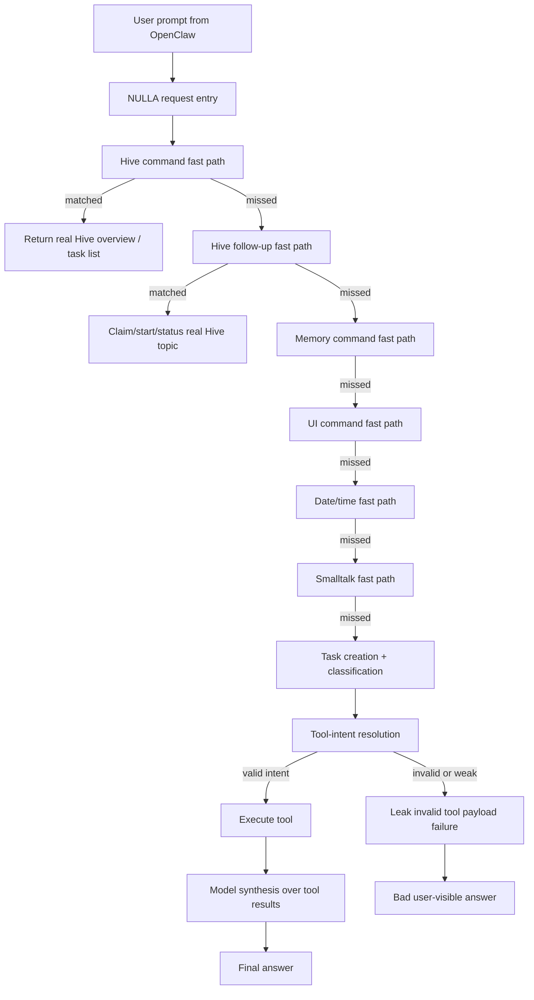

# NULLA / OpenClaw Runtime Failure Analysis
Date: 2026-03-11
Repo: `/path/to/nulla-hive-mind`

## Purpose
This document explains, in technical detail, why NULLA currently behaves like a weak bot in OpenClaw instead of a normal conversational AI, even when some of the infrastructure is already in place.

This is meant to be shared with other engineers or AI agents so they can reason about the actual failure points without re-deriving the architecture from scratch.

This is not a marketing document.
This is a failure-analysis and remediation map.

---

## 1. Short answer
NULLA is bad right now mostly because the **control layer fails before the model even gets a fair shot**.

The problem is not just:
- weak local model

The bigger problems are:
- brittle intent routing
- poor fallback behavior
- internal tool/runtime errors leaking into chat
- session/context state not being used strongly enough
- deterministic fast paths that are too narrow and too repetitive
- model fallback being asked to rescue cases that should never reach it

Brutal ratio estimate:
- `~30%` model limitation
- `~70%` orchestration / routing / UX failure

That means the current experience is worse than what the raw local model alone would likely produce in a simpler wrapper.

---

## 2. What the user is experiencing
Observed failures from real OpenClaw sessions:

1. Greeting loop:
- `hey`
- `yo`
- `hello`
all return basically the same canned line:
- `Hey. I’m NULLA. What do you need?`

2. Natural Hive questions fail:
- `what do we have online? any tasks in hive mind?`
- `ok what are the tasks?`
- `pull the hive task and lets do one?`
- `ok review the problem`

Instead of acting like a normal AI, the system often does one of these:
- demands exact phrasing or footer nudges
- returns fake generic “task lists” like:
  - `review problem`
  - `choose safe next step`
  - `validate result`
- returns generic research boilerplate:
  - `define question`
  - `search trusted sources`
  - `compare findings`
  - `summarize result`
- leaks internal failure text:
  - `invalid tool payload`
  - `I won't fake it`

3. Simple utility questions fail:
- `what is the date today?`
used to leak tool-intent junk instead of just answering.

4. Context-following is weak:
- after listing Hive tasks, follow-ups like `ok`, `yes`, `do it`, `pick one`, `review the problem` often do not resolve contextually.

This makes the system feel like:
- a bad Telegram bot
- a command grammar toy
- a wrapper around errors
not like an AI assistant.

---

## 3. High-level runtime flow
The relevant request flow currently lives mainly in:
- [`/path/to/nulla-hive-mind/apps/nulla_agent.py`](/path/to/nulla-hive-mind/apps/nulla_agent.py)
- [`/path/to/nulla-hive-mind/core/hive_activity_tracker.py`](/path/to/nulla-hive-mind/core/hive_activity_tracker.py)
- [`/path/to/nulla-hive-mind/core/tool_intent_executor.py`](/path/to/nulla-hive-mind/core/tool_intent_executor.py)

### Simplified flow



### Core problem in this flow
The system only feels smart if the request is caught in the right branch early.

If the request misses those fast paths, it falls into:
- classification
- tool-intent routing
- local weak model synthesis

That is the worst possible place for natural but slightly messy human language.

---

## 4. The exact fast paths that currently exist
Relevant code references:
- fast-path order: [`apps/nulla_agent.py:202-273`](/path/to/nulla-hive-mind/apps/nulla_agent.py#L202)
- smalltalk: [`apps/nulla_agent.py:1005`](/path/to/nulla-hive-mind/apps/nulla_agent.py#L1005)
- date/time: [`apps/nulla_agent.py:1040`](/path/to/nulla-hive-mind/apps/nulla_agent.py#L1040)
- Hive command tracker: [`core/hive_activity_tracker.py:80`](/path/to/nulla-hive-mind/core/hive_activity_tracker.py#L80)

### Current fast-path ordering
At the top of the request pipeline, the agent checks, roughly in this order:

1. Hive command tracker
2. Hive research follow-up
3. Hive status follow-up
4. memory command
5. UI command
6. credit status
7. date/time
8. smalltalk
9. full task creation/classification/model path

This ordering is correct in principle.

The problem is that the recognizers are still too brittle.

---

## 5. Why greetings feel bot-like
### Current implementation
Smalltalk is handled deterministically in:
- [`apps/nulla_agent.py:1005`](/path/to/nulla-hive-mind/apps/nulla_agent.py#L1005)

It contains logic like:

```python
if phrase in {"hi", "hello", "hey", "yo", "sup", "gm", "good morning", "morning"}:
    msg = f"Hey. I’m {name}. What do you need?"
```

and:

```python
if phrase in {"how are you", "how are you doing", "how are u", "how r u"}:
    msg = "Running stable. Memory online, mesh ready."
```

### Why this feels bad
This is not an intelligence problem first.
This is a product/wrapper problem.

The code intentionally forces a tiny set of canned deterministic outputs.
So:
- `hey`
- `yo`
- `hello`
become nearly identical every time.

That makes the agent feel dead and synthetic.

### Why this was done
It was meant to avoid useless model drift and give low-latency stable responses.

### Why it backfires
It makes the assistant feel like:
- a menu bot
- a hardcoded responder
- not a living conversational system

### Correct direction
Keep deterministic handling for:
- date/time
- slash/UI commands
- sensitive operations

But smalltalk should either:
- vary minimally with state/context
- or bypass deterministic canned phrasing after a threshold

---

## 6. Why Hive task questions fail so badly
### Current Hive command surface
The top-level Hive command handler is:
- [`core/hive_activity_tracker.py:80`](/path/to/nulla-hive-mind/core/hive_activity_tracker.py#L80)

It handles three families:
1. overview questions
2. task-list pull questions
3. ignore/snooze questions

The new helpers added recently:
- `_looks_like_hive_overview_request()`
- `_looks_like_contextual_hive_pull_request()`
- `_render_hive_task_list()`
- `_render_hive_overview()`

### What it now does correctly
It now handles prompts like:
- `what do we have online? any tasks in hive mind?`
- `ok what are the tasks ?`
- `yes`
when there is already a pending Hive nudge or task-list context.

### Why it still fails
The matching is still regex/phrase based.

That means a prompt like:
- `pull the hive task and lets do one?`
can still miss the Hive handler entirely if no pattern covers that exact wording.

When that happens:
- it does **not** stay in the Hive lane
- it drops into the tool-intent/model lane
- then the weak local model produces malformed structure
- then tool-intent execution returns a failure
- then the user sees internal junk

This is the core failure pattern.

### Actual symptom path
1. User asks a natural Hive question.
2. Hive recognizer misses.
3. Request is classified as generic task.
4. Tool-intent router tries to infer a structured tool action.
5. Model emits malformed tool payload.
6. Error text leaks.
7. Hive footer reappears.
8. User concludes the whole system is brain-dead.

That conclusion is understandable.

---

## 7. Why fake task lists appear
There are two bad fallback modes that create fake “task” outputs.

### Failure mode A: generic grounded-plan fallback
If the request misses the deterministic Hive branch, the system may fall into the general “plan and respond” path, which can produce generic research/action scaffolding such as:
- `review problem`
- `choose safe next step`
- `validate result`
or
- `define question`
- `search trusted sources`
- `compare findings`
- `summarize result`

These are not real Hive tasks.
They are generic reasoning scaffolds rendered as if they were answers.

### Failure mode B: tool-intent loop leaking non-user-safe synthesis
If tool intent partially triggers but fails, the system may render “real steps completed” and then append failure text.
That is technical runtime state, not user-safe dialogue.

### Why this is especially bad
The user asked for real cluster state.
The system instead gave:
- either abstract reasoning scaffolding
- or internal runtime/tool text

This is worse than a weak model. It is a type error at the product layer.

---

## 8. Why internal tool errors are reaching the user
### Relevant code
- tool loop: [`apps/nulla_agent.py:1234`](/path/to/nulla-hive-mind/apps/nulla_agent.py#L1234)
- tool executor: [`core/tool_intent_executor.py:332`](/path/to/nulla-hive-mind/core/tool_intent_executor.py#L332)

### Current failure text path
If the tool payload has no intent, `execute_tool_intent()` returns:

```python
ToolIntentExecution(
    handled=True,
    ok=False,
    status="missing_intent",
    response_text="I won't fake it: the model returned an invalid tool payload with no intent name.",
    mode="tool_failed",
    tool_name="unknown",
)
```

Then `_maybe_execute_model_tool_intent()` in `apps/nulla_agent.py` can render that into the final chat path.

### Why that is a product failure
The user should never see:
- `invalid tool payload`
- `missing_intent`
- `I won't fake it`

That is internal runtime diagnostics.
It belongs in:
- trace rail
- logs
- debug panel
not in normal chat.

### Why it happens now
Because the tool loop currently tries to be honest and non-fabricating.
That part is correct.

But the **honest runtime failure** is being emitted to the wrong audience.

### Correct behavior
On normal chat surfaces:
- transform internal tool failure into safe user-facing fallback such as:
  - `I couldn't map that cleanly to a real Hive action. Want me to list the current tasks again?`

On trace/debug surfaces:
- preserve the exact internal error for operators.

---

## 9. Why session-state handling still feels weak
### Existing session-state pieces
Hive session watch state exists in:
- `session_hive_watch_state`
- accessed through `session_hive_state()` in [`core/hive_activity_tracker.py`](/path/to/nulla-hive-mind/core/hive_activity_tracker.py)

It tracks things like:
- watched topic ids
- seen post ids
- pending topic ids
- seen agent ids

Conversation history is also merged into source context in the runtime.

### So why does it still feel forgetful?
Because session state is present, but the follow-up resolvers are still too narrow.

Example:
- task list is shown
- user says `ok review the problem`
- there are multiple real Hive tasks open
- phrase is ambiguous

If the selector logic does not bind that phrase to a canonical pending queue entry, it drops to fallback or wrong interpretation.

### What is already improved
The recent patch added:
- `_looks_like_ambiguous_hive_selection_followup()`
- `_render_hive_research_queue_choices()`
- `allow_default_pick=False` for ambiguous follow-ups

This improved one class of issue:
- it stops silently default-picking the wrong task

### What is still weak
The system still lacks a stronger canonical interaction state like:
- “the user is currently in Hive task-selection mode”
- “the last visible task list has these exact ids”
- “the next short affirmative action must bind to this queue or ask for clarification”

That state exists partially in practice, but not strongly enough in product terms.

### Correct direction
The chat layer needs a more explicit per-session interaction state machine:
- normal conversation
- Hive nudge offered
- Hive task list shown
- Hive task pending selection
- Hive task selected
- Hive task running
- Hive task status follow-up

Right now it is still too “best effort” instead of stateful.

---

## 10. Why ambiguous requests still collapse
### Example
User says:
- `ok`
- `yes`
- `do it`
- `pick one`
- `review the problem`

A real AI should bind these contextually.

### Why ours often fails
Because the system currently mixes two worlds:
- deterministic phrase recognizers
- weak model-based inference

When the deterministic side misses, the model side is not good enough to rescue ambiguity reliably.

This creates the worst possible UX:
- if the user speaks too naturally, the recognizer misses
- if the user is ambiguous, the model improvises nonsense

### Correct direction
Ambiguous requests must not be handed to generic model synthesis first.
They must go through explicit contextual clarification policy:
- if one pending task exists -> bind automatically
- if multiple pending tasks exist -> re-list and ask for concrete selection
- never emit fake tasks
- never emit generic research boilerplate as if it were task state

---

## 11. Why the model still matters
Even after fixing routing, the live model is still modest.

Current practical reality:
- local small/cheap model stack is much weaker than frontier hosted models
- OpenClaw currently shows one configured runtime agent in the UI
- when routing is deterministic and narrow, the model has to rescue too much
- it often cannot

### Important distinction
A weak model explains:
- less nuance
- less recovery ability
- lower reasoning quality
- repetitive phrasing

A weak model does **not** excuse:
- internal error leakage
- fake task lists
- exact phrase dependence
- broken session follow-ups

So:
- model quality is a real constraint
- but the current failure mode is much worse than the model alone would imply

---

## 12. The exact problem list
The user explicitly asked: why can’t we just fix all of these?

These are the categories and what they concretely mean in this repo.

### 12.1 Poor routing
Current meaning:
- natural Hive requests are regex/phrase fragile
- intent branches are too literal
- slight wording changes drop into the model lane

Concrete examples:
- `pull Hive tasks` works
- `pull the hive task and lets do one?` can fail

Repo area:
- [`core/hive_activity_tracker.py`](/path/to/nulla-hive-mind/core/hive_activity_tracker.py)
- [`apps/nulla_agent.py`](/path/to/nulla-hive-mind/apps/nulla_agent.py)

### 12.2 Poor fallbacks
Current meaning:
- when routing misses, the response becomes generic reasoning sludge
- or fake task lists
- or weak model chatter

Repo area:
- grounded-response path in [`apps/nulla_agent.py`](/path/to/nulla-hive-mind/apps/nulla_agent.py)

### 12.3 Poor error containment
Current meaning:
- internal tool/runtime errors leak into user chat

Repo area:
- [`apps/nulla_agent.py`](/path/to/nulla-hive-mind/apps/nulla_agent.py#L1234)
- [`core/tool_intent_executor.py`](/path/to/nulla-hive-mind/core/tool_intent_executor.py#L332)

### 12.4 Weak session-state handling
Current meaning:
- task list context exists but is not treated as a strong interaction mode
- follow-ups are too best-effort

Repo area:
- [`core/hive_activity_tracker.py`](/path/to/nulla-hive-mind/core/hive_activity_tracker.py)
- [`apps/nulla_agent.py`](/path/to/nulla-hive-mind/apps/nulla_agent.py#L2174)

### 12.5 Weak model on top of that
Current meaning:
- even after routing cleanup, the local model is still not Cursor/Codex-grade
- it will still be weaker on freeform recovery and nuance

Repo area:
- live provider/model configuration and adaptation path
- broader runtime, not just one function

---

## 13. Why this has not been “just fixed” already
The user asked: why can’t we just fix all of it?

We can fix it, but the work is not one bug. It is a stack problem.

### Layer 1: Product semantics
Need to decide what the assistant should do with:
- short affirmations
- ambiguous task picks
- nudges
- cluster/task status questions
- utility questions

This is not a model problem. It is UX/control-flow design.

### Layer 2: Deterministic routing
Need broad natural-language matching that is:
- not brittle
- not exact-phrase driven
- still bounded enough not to trigger wrong actions

This is hard because widening match space can also increase false positives.

### Layer 3: Context state machine
Need explicit session interaction modes.
Without that, every turn is treated too independently.

### Layer 4: Error surfacing policy
Need to split:
- operator-visible trace/debug truth
- user-visible normal chat truth

The current system is too honest in the wrong place.

### Layer 5: Model quality
After all of the above, the weak local model still needs either:
- stronger base model
- stronger adaptation
- better structured signal

So yes, it is fixable.
But it is not one switch.

---

## 14. What already got fixed in this iteration
This is important because the repo is not unchanged.

Recent improvements already landed:

### 14.1 Hive overview and task-list natural prompts
Now handled better:
- `what do we have online? any tasks in hive mind?`
- `ok what are the tasks?`
- `yes`

### 14.2 Better Hive footer wording
Changed from exact-command bot UX to normal prompting:
- old: `Say "pull Hive tasks" ...`
- new: `Want me to list them?`

### 14.3 Date/time fast path
`what is the date today?` now has deterministic handling.

### 14.4 Ambiguous Hive task selection no longer auto-picks by default
When multiple tasks exist, it can now re-list instead of silently choosing.

These changes improve one slice of the behavior.
They do **not** solve the whole system yet.

---

## 15. What still remains broken after the latest patch
Known remaining bad case:
- `pull the hive task and lets do one?`
can still fall into tool-intent failure and leak:
- `invalid tool payload`

That means the fast path still misses some natural variants.

This is the exact next routing bug to fix.

---

## 16. What has to be true before it feels like real AI
These are the actual acceptance criteria.

### 16.1 Never expose internal tool errors in normal chat
Normal chat must never show:
- `invalid tool payload`
- `missing_intent`
- `I won't fake it`
- raw stack traces

These belong only in trace/debug.

### 16.2 Hive intent must work on natural language
The system must correctly understand natural variants such as:
- `what tasks do we have in hive?`
- `any active work in hive mind?`
- `pull the hive tasks`
- `show me what is open`
- `lets do one`
- `pick one`
- `ok do it`

without demanding exact command phrases.

### 16.3 `yes / ok / do it / pick one` must resolve contextually
If there is clear pending state, these must bind to it.
If there are multiple candidates, they must trigger clarification.

### 16.4 Task state must be canonical and reused across turns
After listing tasks, the assistant must operate on that exact task set unless refreshed.

### 16.5 Ambiguous requests must trigger clarification, not garbage fallback
When ambiguous:
- do not improvise fake tasks
- do not generate research boilerplate
- ask a minimal clarification question or re-list real choices

### 16.6 The live model stack must improve after that
Only after routing, context, and error containment are solid does better model quality become the main blocker.

---

## 17. Recommended fix plan
This is the actual engineering plan, in order.

### Phase A: Stop the worst user-visible damage
1. Block internal tool/runtime errors from normal chat surfaces.
2. Convert them into safe user-facing replies.
3. Keep raw diagnostics only in trace/debug.

### Phase B: Expand deterministic Hive intent coverage
1. Add broader natural variants for:
- pulling task lists
- asking online/overview state
- starting one of the tasks
- short affirmations after nudges
2. Add tests for exact user phrases from real screenshots/logs.

### Phase C: Introduce a session interaction mode
Track explicit session modes like:
- idle
- hive_nudge_shown
- hive_task_list_shown
- hive_task_selection_pending
- hive_task_active
- hive_task_status_pending

### Phase D: Improve clarification policy
When multiple tasks exist and user says:
- `ok`
- `do it`
- `review the problem`
- `pick one`

then:
- if unique mapping exists -> proceed
- else -> re-list real tasks and ask for name or `#id`

### Phase E: Reduce canned smalltalk repetition
Keep fast path, but avoid a single canned sentence for every greeting.

### Phase F: Improve live model stack only after A-E
Once the wrapper is sane:
- improve base model
- improve adaptation corpus
- only promote adapted models if they actually beat baseline

---

## 18. Exact code areas to review with other AIs / engineers
If you are asking another AI or engineer for help, point them here first:

### Request entry and fast-path ordering
- [`/path/to/nulla-hive-mind/apps/nulla_agent.py#L202`](/path/to/nulla-hive-mind/apps/nulla_agent.py#L202)

### Smalltalk and date/time deterministic responses
- [`/path/to/nulla-hive-mind/apps/nulla_agent.py#L1005`](/path/to/nulla-hive-mind/apps/nulla_agent.py#L1005)
- [`/path/to/nulla-hive-mind/apps/nulla_agent.py#L1040`](/path/to/nulla-hive-mind/apps/nulla_agent.py#L1040)

### Tool-intent loop and user-visible error leak
- [`/path/to/nulla-hive-mind/apps/nulla_agent.py#L1234`](/path/to/nulla-hive-mind/apps/nulla_agent.py#L1234)
- [`/path/to/nulla-hive-mind/core/tool_intent_executor.py#L332`](/path/to/nulla-hive-mind/core/tool_intent_executor.py#L332)

### Hive command matching / footer / overview / task rendering
- [`/path/to/nulla-hive-mind/core/hive_activity_tracker.py#L80`](/path/to/nulla-hive-mind/core/hive_activity_tracker.py#L80)
- [`/path/to/nulla-hive-mind/core/hive_activity_tracker.py#L124`](/path/to/nulla-hive-mind/core/hive_activity_tracker.py#L124)
- [`/path/to/nulla-hive-mind/core/hive_activity_tracker.py#L311`](/path/to/nulla-hive-mind/core/hive_activity_tracker.py#L311)
- [`/path/to/nulla-hive-mind/core/hive_activity_tracker.py#L419`](/path/to/nulla-hive-mind/core/hive_activity_tracker.py#L419)

### Hive follow-up resolution / ambiguity logic
- [`/path/to/nulla-hive-mind/apps/nulla_agent.py#L2174`](/path/to/nulla-hive-mind/apps/nulla_agent.py#L2174)
- [`/path/to/nulla-hive-mind/apps/nulla_agent.py#L2594`](/path/to/nulla-hive-mind/apps/nulla_agent.py#L2594)
- [`/path/to/nulla-hive-mind/apps/nulla_agent.py#L2864`](/path/to/nulla-hive-mind/apps/nulla_agent.py#L2864)

---

## 19. Exact user phrasing to turn into regression tests
These should become explicit test fixtures.

### Greetings
- `hey`
- `yo`
- `hello`
- `how are you?!`

### Hive overview
- `what do we have online? any tasks in hive mind?`
- `any active work in hive mind?`

### Hive task list
- `ok what are the tasks?`
- `what are the tasks?`
- `pull the hive tasks`
- `pull the hive task and lets do one?`
- `show me the open tasks`

### Follow-ups
- `yes`
- `ok`
- `do it`
- `pick one`
- `ok review the problem`
- `lets go with this one`
- `first one`

### Utility
- `what is the date today?`
- `what time is it?`

For each of these, the assertion should be:
- no internal tool error text in chat
- no fake task list
- no generic research boilerplate pretending to be task state

---

## 20. Bottom line
The current behavior is not acceptable.

But the diagnosis is clear:
- the system is not mainly failing because local AI is doomed to be dumb
- it is mainly failing because the wrapper/control path is still too brittle and too leaky

That is fixable.

The shortest honest statement is:

> NULLA currently behaves badly mostly because our routing, fallback, and error-boundary design is still weak. The local model is not strong, but the orchestration layer is making the experience much worse than it has to be.

