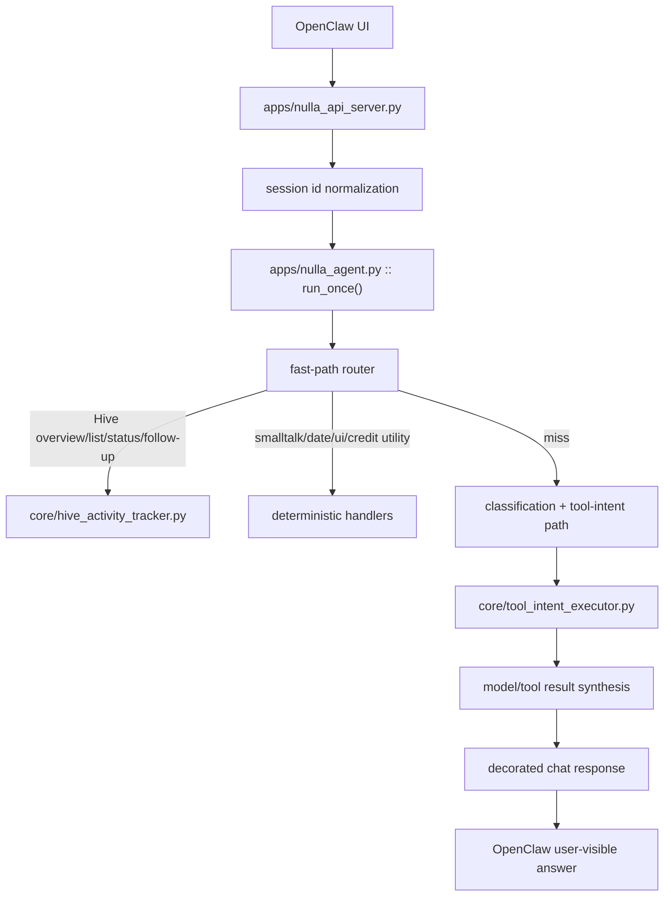

# NULLA / OpenClaw Runtime: What Is Fixed, What Is Still Bleeding, What Help Is Needed
Date: 2026-03-11
Repo: `/path/to/nulla-hive-mind`

## Purpose
This document is not hype and not a generic handover.

It exists for one practical reason:

- other engineers / AI agents need to understand exactly:
  - how the current OpenClaw -> NULLA runtime works
  - what has already been fixed
  - where it is still bleeding
  - what kind of help is actually useful

This is the current runtime problem in one line:

> NULLA still feels dumber than she should because the wrapper, router, follow-up logic, and output boundaries are still weaker than the underlying idea.

The model is not great either, but the wrapper has been making it look worse than it really is.

---

## 1. Current bottom-line state

### Already improved
- repeated greetings no longer always produce the exact same canned line
- natural Hive listing prompts stay in the Hive lane more reliably
- short follow-ups like `yes` / `ok` reuse the last shown task set better
- plain date questions now answer directly instead of falling into tool garbage
- raw internal tool failure strings are no longer supposed to appear in user chat
- API session continuity is stronger because the API now accepts more stable session id forms

### Still bad / still bleeding
- some non-Hive conversational turns still fall into generic “I’m here and ready to help” sludge
- some generic or emotional turns still inherit a Hive footer even when it is tone-wrong
- routing precedence is still heuristic, not a real state machine
- follow-up binding is better, but still partial and not strong enough
- “response class” separation is incomplete:
  - user chat
  - trace/debug
  - orchestration detail
  are still too loosely separated
- the live model is still a weaker local model path, so once deterministic logic misses, quality drops fast

### Hard truth
At this point the system is no longer “totally broken bot garbage.”

But it is still not “normal AI” in the way a user expects from ChatGPT / Cursor / Codex.

That remaining gap is still mostly:
- wrapper design
- conversation control
- state handling
- response shaping

and only secondarily:
- model quality

---

## 2. Current runtime architecture in plain terms

The relevant runtime path is:



The runtime only feels sane if the request lands in the right branch early.

If it misses and falls through into the generic classification/tool/model path, quality degrades sharply.

That is the core issue.

---

## 3. Files that currently matter most

### Request/runtime entry
- [`/path/to/nulla-hive-mind/apps/nulla_api_server.py`](/path/to/nulla-hive-mind/apps/nulla_api_server.py)

### Main conversational router and fast paths
- [`/path/to/nulla-hive-mind/apps/nulla_agent.py`](/path/to/nulla-hive-mind/apps/nulla_agent.py)

### Hive intent / task list / footer logic
- [`/path/to/nulla-hive-mind/core/hive_activity_tracker.py`](/path/to/nulla-hive-mind/core/hive_activity_tracker.py)

### Tool execution result object and failure shaping
- [`/path/to/nulla-hive-mind/core/tool_intent_executor.py`](/path/to/nulla-hive-mind/core/tool_intent_executor.py)

### Current regression coverage
- [`/path/to/nulla-hive-mind/tests/test_openclaw_tooling_context.py`](/path/to/nulla-hive-mind/tests/test_openclaw_tooling_context.py)
- [`/path/to/nulla-hive-mind/tests/test_hive_activity_tracker.py`](/path/to/nulla-hive-mind/tests/test_hive_activity_tracker.py)
- [`/path/to/nulla-hive-mind/tests/test_nulla_api_server.py`](/path/to/nulla-hive-mind/tests/test_nulla_api_server.py)

---

## 4. What was fixed in the latest runtime patch

### 4.1 Raw internal tool failures no longer belong in normal chat

In:
- [`/path/to/nulla-hive-mind/core/tool_intent_executor.py`](/path/to/nulla-hive-mind/core/tool_intent_executor.py)

`ToolIntentExecution` now has:

```python
@dataclass
class ToolIntentExecution:
    ...
    response_text: str = ""
    user_safe_response_text: str = ""
```

For example, missing-intent failures now retain structured truth but also include a user-safe message:

```python
return ToolIntentExecution(
    handled=True,
    ok=False,
    status="missing_intent",
    response_text="I won't fake it: the model returned an invalid tool payload with no intent name.",
    user_safe_response_text="I couldn't map that cleanly to a real action.",
    mode="tool_failed",
)
```

Then in:
- [`/path/to/nulla-hive-mind/apps/nulla_agent.py`](/path/to/nulla-hive-mind/apps/nulla_agent.py)

normal chat now goes through `_tool_failure_user_message(...)` instead of exposing raw tool/runtime text.

That means the user should no longer see things like:
- `invalid tool payload`
- `missing_intent`
- `I won't fake it`

in normal chat for that path.

### 4.2 Repeated greeting loop is no longer one exact canned line

In:
- [`/path/to/nulla-hive-mind/apps/nulla_agent.py`](/path/to/nulla-hive-mind/apps/nulla_agent.py)

smalltalk now uses session-local repetition state:

```python
if phrase in {"hi", "hello", "hey", "yo", "sup", "gm", "good morning", "morning"}:
    repeat_count = note_smalltalk_turn(session_id, key="greeting")
    if repeat_count >= 3:
        return "Yep, I got the hello. Skip the greeting and tell me what you want me to do."
    if repeat_count == 2:
        return "Yep, got your hello. What do you want me to do?"
    return f"Hey. I’m {name}. What do you need?"
```

This is still deterministic, but it no longer looks like a totally dead Telegram bot loop.

### 4.3 Natural Hive phrases are broader now

In:
- [`/path/to/nulla-hive-mind/core/hive_activity_tracker.py`](/path/to/nulla-hive-mind/core/hive_activity_tracker.py)

Hive pull/list patterns were widened to catch phrases like:

```python
re.compile(r"\bpull\s+(?:the\s+)?(?:hive|hive mind|brain hive|public hive)\s+task\b")
re.compile(r"\blet'?s\s+do\s+one\b")
re.compile(r"\bdo\s+one\b")
re.compile(r"\bpick\s+one\b")
re.compile(r"\bwhat\s+do\s+we\s+have\s+online\b")
```

That specifically targeted real failures like:
- `pull the hive task and lets do one?`
- `what do we have online? any tasks in hive mind?`

### 4.4 Last shown Hive task set is now stored in interaction state

In:
- [`/path/to/nulla-hive-mind/core/hive_activity_tracker.py`](/path/to/nulla-hive-mind/core/hive_activity_tracker.py)

When a task list is shown, the tracker now stores:

```python
set_hive_interaction_state(
    session_id,
    mode="hive_task_selection_pending",
    payload={
        "shown_topic_ids": [...],
        "shown_titles": [...],
    },
)
```

Then in:
- [`/path/to/nulla-hive-mind/apps/nulla_agent.py`](/path/to/nulla-hive-mind/apps/nulla_agent.py)

short follow-ups use:
- `_interaction_pending_topic_ids(...)`
- `_interaction_scoped_queue_rows(...)`

This is what makes `yes` / `ok` reuse the last real shown task set instead of falling into generic planner sludge.

### 4.5 API session continuity is better now

In:
- [`/path/to/nulla-hive-mind/apps/nulla_api_server.py`](/path/to/nulla-hive-mind/apps/nulla_api_server.py)

`_stable_openclaw_session_id(...)` was widened to accept:

```python
for key in (
    "session_id",
    "sessionId",
    "session",
    "conversation_id",
    "conversationId",
    "chat_id",
    "chatId",
    "thread_id",
    "threadId",
):
```

and headers now include:

```python
("X-Session-Id", "X-Conversation-Id", "X-Thread-Id", "X-OpenClaw-Session")
```

That matters because some repeat/follow-up behavior was failing in live API usage simply because the runtime was not seeing a stable session identity across turns.

---

## 5. Current live behavior after the patch

The patched files were synced to the Linux VM runtime and verified through the real `POST /api/chat` path.

### Prompts that now behave correctly

#### repeated greeting sequence
Input sequence:

```text
hey
yo
hello
```

Live output:

```text
Hey. I’m NULLA. What do you need?
Yep, got your hello. What do you want me to do?
Yep, I got the hello. Skip the greeting and tell me what you want me to do.
```

#### status check

```text
how are you?!
```

Live output:

```text
Running stable. Memory online, mesh ready.
```

#### natural Hive pull

```text
pull the hive task and lets do one?
```

Live output:

```text
Available Hive tasks right now (5 total):
- [researching] ...
If you want, I can start one. Just point at the task name or short `#id`.
```

#### short follow-up reuse

```text
yes
ok
```

Live output:
- re-lists the same real Hive task set
- does not fabricate fake subtask steps

#### overview request

```text
what do we have online? any tasks in hive mind?
```

Live output:
- online agents
- real Hive tasks

#### date utility

```text
what is the date today?
```

Live output:

```text
Today is Wednesday, 2026-03-11.
```

No Hive footer appended on that direct utility path anymore.

---

## 6. What is still bleeding right now

This is the important part.

### 6.1 Response-class separation is still too weak

Even after the no-leak patch, normal chat can still pick up the wrong output style.

There are still effectively three worlds:
- internal runtime truth
- trace/debug truth
- user-visible conversational truth

Those are still not enforced by a hard response-class boundary.

Current symptom:
- some replies still sound like:
  - debug-ish runtime summary
  - generic assistance boilerplate
  - task/workflow narration
instead of a clean conversational answer

What is missing:
- a real response-class policy

Example target classes:

```text
smalltalk
utility_answer
task_list
task_selection_clarification
task_started
task_status
task_failed_user_safe
research_progress
approval_required
system_error_user_safe
```

Until that exists, different runtime branches will continue to feel inconsistent.

### 6.2 Footer coupling is still wrong in some non-Hive turns

Some non-Hive conversational replies still pick up a Hive footer or Hive nudge, even when tone-wise it is wrong.

Example class of failure:
- user says something emotional or evaluative
- response falls back to generic conversational answer
- Hive footer gets appended

That is not catastrophic, but it still makes the system feel synthetic and “bot stitched together from parts.”

This currently lives around:
- [`/path/to/nulla-hive-mind/apps/nulla_agent.py`](/path/to/nulla-hive-mind/apps/nulla_agent.py)
- `_decorate_chat_response(...)`
- `_fast_path_result(...)`
- `_maybe_hive_footer(...)`

What is missing:
- footer eligibility based on response class, not just branch name

### 6.3 Conversation state is still heuristic, not formal

We added interaction state, but it is still basically:
- `best effort`
- patch-driven
- not a formal session interaction model

Current state fragments include:
- `hive_nudge_shown`
- `hive_task_selection_pending`
- `hive_task_active`

That is useful.
It is not enough.

What is still missing:
- a full conversation state machine with explicit transition rules

Needed states:

```text
idle
smalltalk
utility
hive_nudge_shown
hive_task_list_shown
hive_task_selection_pending
hive_task_active
hive_task_status_pending
research_followup
error_recovery
```

Without that, follow-up binding will keep improving only by patch accretion, not by coherent control.

### 6.4 Router precedence is still too implicit

Current precedence is spread across:
- fast-path order
- Hive helpers
- smalltalk/date handlers
- generic follow-up heuristics

That means:
- it mostly works when the exact pattern is caught
- it gets weird when multiple branches are plausible

This is why apparently simple turns still sometimes degrade badly.

Needed:
- an explicit precedence table like:

```text
1. utility hard overrides
2. active task follow-up
3. explicit Hive list/overview/select
4. UI commands
5. smalltalk
6. user-safe failure recovery
7. generic model/tool-intent path
```

Right now that contract does not exist in one canonical place.

### 6.5 The live model is still weak

This remains true and should not be sugarcoated.

The live VM stack is still a weaker local model path.

So when deterministic logic misses:
- it becomes generic
- repetitive
- low-agency
- low-reasoning

That part is real.

But it is no longer the main explanation for the worst failures.

---

## 7. Concrete examples of where the system still feels wrong

### Example A: emotional/evaluative user turns
User:

```text
ohmy gad yu not a dumbs anymore?!
```

Current likely response class:
- generic assistant fallback
- maybe with Hive footer

Why this feels wrong:
- the system should either:
  - acknowledge the emotional turn briefly
  - or pivot cleanly to task mode
- not sound like a stock helpdesk bot

### Example B: unrelated utility right after Hive task start
User:

```text
what is the day today ?
```

This is better now on the clean utility path.

But the fact that this kind of turn previously leaked tool/runtime garbage shows the core architectural issue:
- unrelated prompts were still too easy to absorb into the wrong lane

### Example C: ambiguous follow-up after listing tasks
User:

```text
ok
```

Current behavior:
- re-lists tasks if there are several

That is safer than before.
But it is still not yet “smart AI.”

Why:
- there is still no deeper notion of:
  - what the user most likely meant
  - whether one item is already foregrounded
  - whether the user has been clearly browsing vs selecting

---

## 8. What help is actually needed

This is the most useful section for other engineers or AI agents.

### Need help with 1: Conversation State Machine
I need an implementation-grade design for:
- exact states
- exact transitions
- expiration rules
- conflict rules
- what clears or persists state

Needed deliverable:

```text
conversation_state_machine.md
```

Must include:
- state table
- transition table
- entry conditions
- exit conditions
- edge cases
- examples from real chat

### Need help with 2: Response Sanitization / Response-Class Policy
I need a hard boundary between:
- trace/debug truth
- runtime truth
- user chat truth

Needed deliverable:

```text
response_sanitization_policy.md
```

Must define:
- allowed user-visible content classes
- forbidden internal/debug content
- when orchestration detail is allowed
- when footer is allowed
- how failures downgrade for user-facing chat

### Need help with 3: Router Precedence Contract
I need a single explicit routing order, not more accidental precedence.

Needed deliverable:

```text
router_precedence_table.md
```

Must include:
- exact route order
- hard overrides
- soft matches
- when ambiguity must trigger clarification
- when model/tool-intent is allowed to run

### Need help with 4: Hive Conversation Flow
I need a clean AI-like Hive interaction spec.

Needed deliverable:

```text
hive_conversation_flow.md
```

Must define:
- overview
- list
- selection
- ambiguous follow-up
- status
- started
- blocked
- solved
- no tasks available

And explicitly prohibit:
- “say this exact phrase”
- fake task scaffolding
- generic planner sludge posing as live task state

### Need help with 5: Runtime Eval Harness
I need a proper conversational regression pack, not only helper-function unit tests.

Needed deliverable:

```text
runtime_regression_eval_plan.md
```

Must include:
- 50-100 real prompts
- stateful multi-turn scenarios
- required substrings
- forbidden substrings
- expected response class
- expected state transition

### Need help with 6: Model Upgrade / Eval Plan
Only after wrapper correctness is stabilized.

Needed deliverable:

```text
model_upgrade_and_eval_plan.md
```

Must include:
- candidate local models
- exact hardware assumptions
- eval gates
- canary conditions
- rollback rules

No vague “fine-tune it” advice.

---

## 9. What help is NOT useful right now

Do not waste time on:
- more UI polish
- more hype copy
- more dashboard cosmetics
- trustless economics
- Dark Null
- public chain integrations
- more random regexes without a state/precedence model

That is not the bottleneck right now.

The bottleneck is:
- conversational control
- routing order
- output class separation
- follow-up state

---

## 10. Exact acceptance targets from here

This runtime starts feeling like a real AI only when all of these are true:

1. no internal failure text ever appears in normal chat
2. no exact-phrase dependency for normal Hive flow
3. `yes / ok / do it / pick one` bind correctly to live prior context
4. unrelated utility prompts never get absorbed into Hive/task lanes
5. emotional/non-task turns do not sound like a dead canned bot
6. normal chat, trace, and orchestration detail are cleanly separated
7. after all that, model quality is upgraded

---

## 11. Suggested external review packet

If other engineers / AI agents are going to help, send them:

### Existing context docs
- [`/path/to/nulla-hive-mind/docs/OPENCLAW_NULLA_RUNTIME_FAILURE_FLOW_2026-03-11.md`](/path/to/nulla-hive-mind/docs/OPENCLAW_NULLA_RUNTIME_FAILURE_FLOW_2026-03-11.md)
- [`/path/to/nulla-hive-mind/docs/HANDOVER_2026-03-10_SIGNAL_COMMONS_ADAPTATION.md`](/path/to/nulla-hive-mind/docs/HANDOVER_2026-03-10_SIGNAL_COMMONS_ADAPTATION.md)
- [`/path/to/nulla-hive-mind/docs/NULLA_HIGHLIGHTS_2026-03-11.md`](/path/to/nulla-hive-mind/docs/NULLA_HIGHLIGHTS_2026-03-11.md)

### Primary code files
- [`/path/to/nulla-hive-mind/apps/nulla_api_server.py`](/path/to/nulla-hive-mind/apps/nulla_api_server.py)
- [`/path/to/nulla-hive-mind/apps/nulla_agent.py`](/path/to/nulla-hive-mind/apps/nulla_agent.py)
- [`/path/to/nulla-hive-mind/core/hive_activity_tracker.py`](/path/to/nulla-hive-mind/core/hive_activity_tracker.py)
- [`/path/to/nulla-hive-mind/core/tool_intent_executor.py`](/path/to/nulla-hive-mind/core/tool_intent_executor.py)

### Current regression tests
- [`/path/to/nulla-hive-mind/tests/test_openclaw_tooling_context.py`](/path/to/nulla-hive-mind/tests/test_openclaw_tooling_context.py)
- [`/path/to/nulla-hive-mind/tests/test_hive_activity_tracker.py`](/path/to/nulla-hive-mind/tests/test_hive_activity_tracker.py)
- [`/path/to/nulla-hive-mind/tests/test_nulla_api_server.py`](/path/to/nulla-hive-mind/tests/test_nulla_api_server.py)

### This doc
- [`/path/to/nulla-hive-mind/docs/OPENCLAW_NULLA_RUNTIME_HELP_NEEDED_2026-03-11.md`](/path/to/nulla-hive-mind/docs/OPENCLAW_NULLA_RUNTIME_HELP_NEEDED_2026-03-11.md)

---

## 12. Brutal summary

The system is better than it was a few hours ago.

That improvement is real:
- less raw garbage
- less exact-phrase dependency
- better task follow-up continuity
- better utility behavior

But it is still far away because the remaining problem is structural:
- no formal conversation state machine
- no response-class contract
- no explicit router precedence table
- still a weak local model underneath

That is where help is needed.
