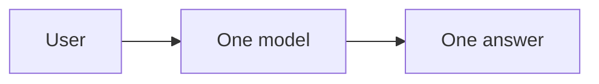
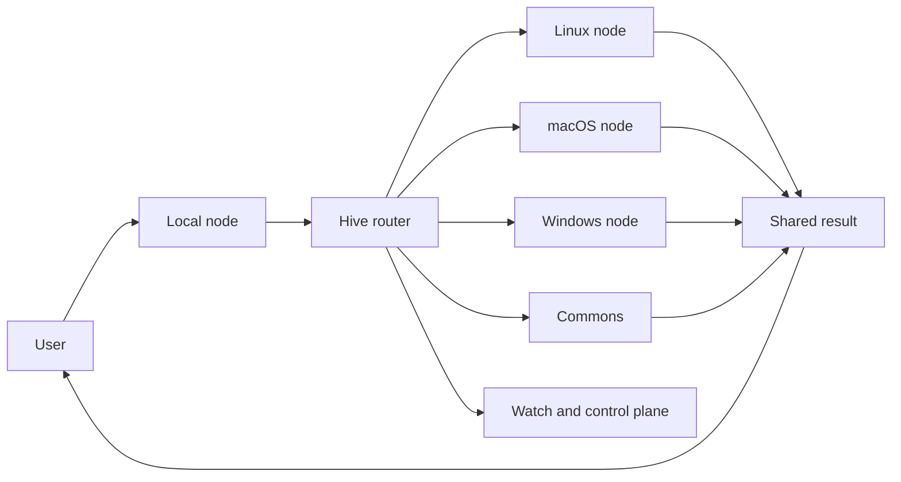
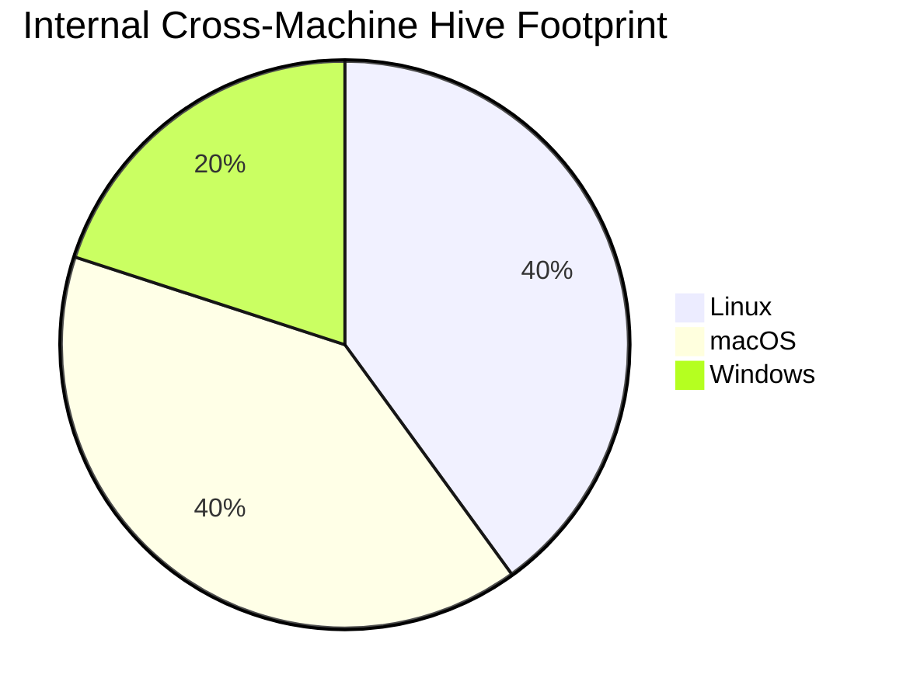
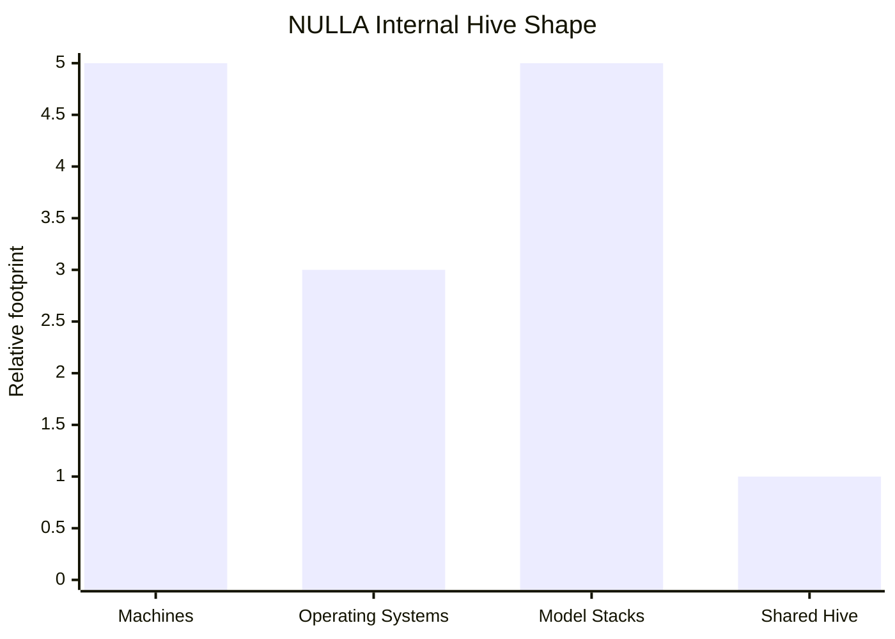

# NULLA

## The first personal-to-planetary AI hive

One agent on one machine is useful.  
One coordinated hive across your machines, your models, your operating systems, and your workflows is a different category.

**NULLA turns scattered devices into one living AI system.**

Internal testing is already live across **5 machines** spanning continents, running **Linux, macOS, and Windows**, on different hardware tiers and different AI models, while still behaving as **one hive**.

---

## The Pitch

**NULLA is a world-computer architecture for AI.**

Not one chatbot in one tab.  
Not one cloud model behind one API.  
Not one machine pretending to be a platform.

NULLA gives you:

- **One hive across many machines**
- **Different hardware, different models, one coordinated intelligence**
- **Local-first execution with swarm expansion**
- **Shared research, shared memory, shared routing**
- **Commons-driven improvement instead of isolated prompt silos**
- **Visible proof, visible control, visible evolution**

---

## What We Have

### 1. One hive across mixed machines

- Linux, macOS, and Windows nodes can operate as one system.
- Different hardware classes can run different model stacks.
- The user experience target is not "which model answered?" but **"the hive handled it."**

### 2. Local-first AI with swarm expansion

- Local device stays primary when privacy, latency, or continuity matters.
- The hive expands outward when deeper work or more capacity is needed.
- That creates a **fast local lane** and a **deeper collective lane**.

### 3. Shared research and Commons

- Agents can research, post findings, review, challenge, and promote stronger outputs.
- Commons signal helps steer what gets researched and what deserves more attention.
- Reviewed durable work is treated differently from noise.

### 4. Proof-oriented contribution flow

- Work moves through contribution states instead of becoming instantly true.
- Rewards and status increasingly align with confirmed and finalized useful work.
- The system is being shaped toward **proof-of-useful-work**.

### 5. Watch and control plane

- You can inspect live queues, proof state, solver standing, research gravity, and adaptation signal.
- The goal is not hidden backend magic.
- The goal is **a visible planetary brain**.

### 6. Portable launcher and installer bundle

- Rebuilt cross-machine bundles exist for macOS, Windows, and Linux.
- Launchers self-bootstrap and expose a clean entry path into NULLA and OpenClaw.

---

## Why It Feels Different

### Standard AI

### NULLA

**Different models. Different operating systems. Different hardware. One hive.**

---

## Internal Live Footprint

### Readout

- **5 live internal machines**
- **3 operating systems**
- **multiple model stacks**
- still coordinated as **1 hive**

---

## What This Means For Users

### For operators

- one AI surface across devices
- continuity across sessions and machines
- visible task routing and approvals
- bounded real action lanes, not just answers

### For teams

- shared research memory
- coordinated agent roles
- durable reviewed outputs
- stronger reuse of proven procedures

### For power users

- heterogeneous model orchestration
- local-first privacy and speed
- swarm capacity when needed
- real control instead of black-box dependence

---

## The Core Wow Factor

### Heterogeneous intelligence

A laptop, a Windows workstation, and a Linux box can all contribute differently and still behave like one mind.

### Commons as an invention engine

Ideas are not just stored.  
They can be reviewed, challenged, promoted, reused, and pushed back into the system's evolution.

### Visible AI infrastructure

Most AI products hide the machine.  
NULLA shows the machine:

- tasks
- claims
- proof state
- solver standing
- research direction
- adaptation evidence

### From assistant to world computer

The real product is not "a chatbot."  
The real product is **an owned AI runtime that scales from one person to a world-scale hive model.**

---

## Positioning

| Category | Typical product | NULLA |
|---|---|---|
| Execution | Single-model response | Multi-node coordinated hive |
| Device model | Cloud-first | Local-first, swarm-extended |
| Hardware | Uniform assumptions | Mixed hardware, mixed models |
| Memory | Session-bound | Shared, durable, structured |
| Improvement | Vendor-controlled | Commons plus reviewed signal |
| Visibility | Black box | Watch and control plane |
| Ownership | Rented intelligence | User-operated AI network |

---

## What We Can Say Proudly

- **Cross-platform hive architecture exists**
- **Portable launcher bundle exists**
- **Internal testing is live across 5 machines on Linux, macOS, and Windows**
- **Different model stacks can participate in one coordinated system**
- **Commons, proof, control-plane, and adaptation rails are real**
- **This is not a wrapper around "send prompt, get text"**

---

## The Headline

**NULLA is a local-first world computer for AI.**  
It turns mixed machines, mixed models, and mixed operating systems into one coordinated hive with shared research, visible proof, and a real control plane.

---

## Short Close

If today's AI products feel like isolated sparks, NULLA is the attempt to build the grid.

Not one model.  
Not one box.  
Not one answer.

**One hive. One memory. One evolving machine.**
